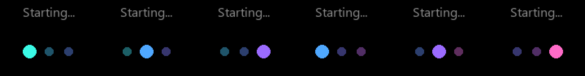

# ESPHome Voice Assistant for the ESP32-S3-BOX-3

A **Home Assistant voice satellite** for the
[ESP32-S3-BOX-3](https://github.com/espressif/esp-box), built on **LVGL and the
touchscreen** instead of the static full-screen images the stock config paints.
Pure ESPHome, no custom C firmware: an always-on core you pull as a package, plus
one thin config file you actually edit.

> **Status: initial build.** Ported from the upstream
> [`wake-word-voice-assistants`](https://github.com/esphome/wake-word-voice-assistants)
> S3-Box-3 config, rebuilt on LVGL + GT911, with the TTS path reworked (see
> below). Not yet confirmed on hardware — see [CHANGELOG.md](CHANGELOG.md).

## What it does

- **Voice assistant**: on-device wake word (`alexa`, `okay_nabu`) via
  `micro_wake_word`, the full Home Assistant Assist pipeline (STT / LLM / TTS),
  and a mic that mutes from HA.
- **LVGL UI**: a page per assistant phase, claimed by whichever screen package
  you install. With none, the core shows plain text status screens; that is the
  floor, not the intended look.
- **Touchscreen**: the GT911 is wired into LVGL. The **button under the screen**
  (which is not a GPIO — it is GT911 touch button 0) starts the assistant, and
  silences a ringing timer instead if one is going. The screen itself is left to
  the UI, so widgets get every tap rather than fighting a full-screen
  tap-to-talk target.
- **Timers**: set by voice, with a countdown and a progress strip on LVGL's top
  layer that stays visible across page changes (green while running, blue while
  paused).
- **TTS routing you choose at runtime**: the reply can come out of the box, out
  of an external Home Assistant media player, or both — see below.
- **Swappable assistant**: the on-screen character is a package — artwork plus
  the measurements of where its face goes — so changing assistants is one line.

## The TTS routing, and why it exists

`voice_assistant:` here has **no `media_player:`**, on purpose.

With one attached, ESPHome does not just hand you the TTS URL — at `TTS_END` it
*also* calls the media player with that URL itself
(`voice_assistant.cpp`: `media_player_->make_call().set_media_url(url)`), so the
box downloads and decodes the audio locally on top of anything you do in
`on_tts_end`. On long replies that local download-and-decode is what made the
device reboot mid-answer while an external speaker played the reply through.

Leaving it out changes nothing about the pipeline — the request flags sent to
Home Assistant don't depend on the media player, so HA still runs TTS and still
delivers the URL to `on_tts_end`. What changes is that **routing is explicit**,
in the `TTS output` select:

| Option | What happens |
|---|---|
| `This device` | The box speaks. Upstream behaviour, local decode included. |
| `External player` | Only `${external_media_player_id}` speaks. The box never fetches the file. |
| `Both` | Both, at the cost of the local decode. |

This routes **spoken replies only**. The timer alarm always rings on the box:
there it repeats until silenced and a tap on the screen stops it, neither of
which a remote speaker can offer, since the box cannot tell when one finishes.
Home Assistant announcements and Music Assistant are unaffected either way —
they go through the `speaker_media_player` component directly.

## Quick start

> Requires **ESPHome 2026.7.0+** — that is where `image:` became a platform component.

1. Copy `secrets.example.yaml` to `secrets.yaml` and fill in your Wi-Fi.
2. Copy **`esp32-s3-box-3-va.yaml`** next to it and edit the `substitutions:` at
   the top (device name, timezone, external media player, artwork). That thin
   file is the only firmware file you keep; the core is pulled from GitHub at
   compile time, see its `packages:` block.
3. **First flash over USB**, then updates go wireless:
   ```
   esphome run esp32-s3-box-3-va.yaml
   ```
   Or drop both files into the ESPHome dashboard's `/config/esphome/` and hit
   Install.
4. In Home Assistant: the new ESPHome device appears, open **Configure** and
   assign an Assist pipeline.
5. Say "Alexa" (or "OK Nabu"), or just tap the screen.

After changing anything in the core, run `esphome clean` before the next build —
otherwise ESPHome reuses the cached copy of the remote package.

## Repository layout

```
esp32-s3-box-3-va.yaml     # YOUR config: copy + edit this (pulls the rest from GitHub)
secrets.example.yaml       # copy to secrets.yaml
base/
  core.yaml                # the always-on core, pulled as a remote package
  screens/
    home.yaml              # optional home screen: clock, date, climate
    face.yaml              # optional animated assistant face (the engine)
  faces/
    pip, astro, momo,      # characters for the face engine
    franky, wizard, genie  #   copy any one of them to add your own
  lang/
    en.yaml, pl.yaml       # UI translations; copy en.yaml to add one
  sounds/
    timer_finished.flac    # the timer alarm, compiled into the firmware
docs/
  HARDWARE.md              # pinout, I2C map, gotchas
scripts/
  validate.py              # offline YAML check (syntax, substitutions, duplicate ids)
  esplog.py                # stream device logs over the native API
skill/
  esp32-s3-box-3/          # Claude Code skill: pinout + hard-won gotchas
```

## Configuration

Day-to-day settings are Home Assistant entities, not config edits: microphone
mute, screen brightness, TTS output, wake word engine location, and the timer
switch.

What lives in the thin config:

| Substitution | Default | What it does |
|---|---|---|
| `name` / `friendly_name` | `esp32-s3-box-3-va` / `S3 Box 3 Voice` | Device name. Changing `name` re-creates every entity in HA. |
| `posix_timezone` | `UTC0` | Clock zone in POSIX form (the device has no IANA database). Only a pre-sync fallback; HA owns the clock. |
| `external_media_player_id` | `media_player.living_room` | Where `External player` / `Both` send the reply. |
| `tts_output_default` | `This device` | Boot default of the `TTS output` select. Routes spoken replies only — the timer alarm always rings on the box. |
| `volume_min` / `volume_max` | `0.5` / `0.8` | Media player clamps for the onboard speaker. |
| `hidden_ssid` | `false` | `true` enables `fast_connect` for a hidden SSID. |
| `idle_page`, `listening_page`, … | `page_status` | Which page each phase shows. Screen packages claim these; set `idle_page: page_home` by hand if you want the clock while idle and the face only while talking. |
| `timer_finished_sound_file` | repo `timer_finished.flac` | The timer alarm, compiled into flash so it rings without network. Always plays on the box's own speaker. Any URL or local MP3/FLAC/WAV. |
| `font_glyphsets` / `extra_glyphs` | `GF_Latin_Core` / `²³` | Characters the UI can render. `GF_Latin_Core` is 319 glyphs and already covers Western *and* Central European accents, so most languages need nothing here. Note the Google Fonts glyphsets are increments, not supersets — `GF_Latin_Plus` (110 glyphs) is not a bigger `Core`, and swapping one for the other loses the accents. |
| `screen_restore_mode` | `ALWAYS_ON` | Backlight at boot. `ALWAYS_ON` so the boot screen is always visible; `RESTORE_DEFAULT_OFF` if the device should remember having been switched off. |
| `mww_gain_factor` | `4` | Input gain for the wake word only (1–64). Raise it if the wake word needs shouting at, lower it if room noise triggers it. |

Pins are substitutions too, but you should not need them unless you are porting
to another board.

## Screens

The core ships one page per assistant phase. Extra screens are optional packages
under `base/screens/` — add the file to your `files:` list to compile it in, drop
the line to leave it out. ESPHome merges each package's `lvgl:` block into one UI.

| Screen | What it adds |
|---|---|
| `home.yaml` | Clock, date, room temperature/humidity and outdoor temperature, as a replacement for the bare idle illustration. Needs `idle_page: page_home` and your HA entity ids; day and month names are substitutions, so it localises without touching the core. |
| `face.yaml` | An animated assistant: a static character image with eyes and a mouth drawn on top as LVGL rectangles, reshaped per phase — blinking while idle, wide-eyed listening, glancing around while thinking, mouth moving while replying, red and shaking when a timer goes off. Claims the active phases and leaves idle alone, so it composes with `home.yaml`: clock when nothing is happening, robot when talking. Only the three small widgets ever redraw, never the background. |

### Characters

The face engine and the character are separate: `base/screens/face.yaml` draws
and animates, a file in [`base/faces/`](base/faces/README.md) supplies the
artwork and the measurements. Swapping the assistant is one line:

```yaml
      files:
        - base/core.yaml
        - base/screens/face.yaml
        - base/faces/pip.yaml      # <- after the engine  (or astro, or momo)
```


Six ship with the repo: **Pip**, **Astro**, **Momo**, **Franky**, **Wizard** and
**Genie**. They differ in more than artwork — eye shape, pupils, colours and the
range of every expression belong to the character, and the face does not have to
sit in the middle of the frame.

Adding a character is `cp pip.yaml yours.yaml`, a faceless 320x240 image, and
measuring where its eyes and mouth belong. Every expression dimension is a
substitution, so a bigger or smaller face rescales without touching the engine.
Details: [`base/faces/README.md`](base/faces/README.md).

## Languages

Every string a screen draws is a substitution, so a language is just a file that
sets them. English is the default and needs no package. To use another, add it to
`files:` **after** the screens — ESPHome resolves later-listed package files at a
higher priority, so a language file listed first is silently ignored:

```yaml
      files:
        - base/core.yaml
        - base/screens/home.yaml
        - base/lang/pl.yaml      # <- last
```

Adding a language is `cp en.yaml xx.yaml` plus translation; `en.yaml` is the
reference and always carries every key. Details and translator notes:
[`base/lang/README.md`](base/lang/README.md). Pull requests welcome.

### Boot screen



Three dots cross-fading through a palette, each a third of a cycle apart, with
the travelling highlight showing progress. Costs three widgets updated six times
a second and only while that page is showing. Recolour it with `boot_palette` —
any number of `0xRRGGBB` entries — or slow it with `boot_tick`.

## No illustrations

Earlier versions shipped a full-screen PNG per phase, ported from upstream. They
are gone. Each was 225 KB of flash — nine of them, over 2 MB — and installing any
character package hid every one of them immediately. The repo now compiles
exactly one image: the character you chose.

What remains in the core is text: three system pages (starting, no Wi-Fi, no
Home Assistant) and one status page the phases fall back to. It is deliberately
plain. The core's job is to work before and without any optional package; making
it pretty is what `base/faces/` is for.

## Why not the upstream config

[`esphome/wake-word-voice-assistants`](https://github.com/esphome/wake-word-voice-assistants)
ships a perfectly good S3-Box-3 config, and this started as a port of it. It
paints the screen with `display:` + `pages:` + full-screen PNGs and never
touches the touch panel. LVGL and `display: pages:` cannot coexist in one
ESPHome config, so anything touch-driven means replacing that layer rather than
extending it. A copy of the upstream file is worth keeping around for reference
while you do.

## Claude Code skill

This repo ships a [Claude Code](https://claude.com/claude-code) skill at
[`skill/esp32-s3-box-3/`](skill/esp32-s3-box-3/SKILL.md): the pinout, the LVGL
and GT911 constraints, and the gotchas that cost real debugging time. Install it
user-wide so any session picks it up:

```bash
cp -r skill/esp32-s3-box-3 ~/.claude/skills/
```

## Credits

- **[esphome/wake-word-voice-assistants](https://github.com/esphome/wake-word-voice-assistants)**:
  the original S3-Box-3 config and the Casita illustrations this is ported from.
- **[espressif/esp-bsp](https://github.com/espressif/esp-bsp)**: the authoritative
  BOX-3 pin map (`bsp/esp-box-3`).
- **ESPHome**: everything the firmware is built out of.
- **[Home Assistant Voice PE](https://github.com/esphome/home-assistant-voice-pe)**:
  the timer sound and the phase model.
