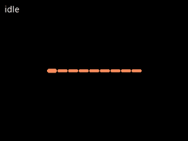
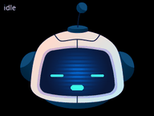
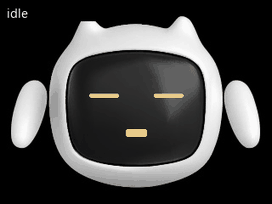
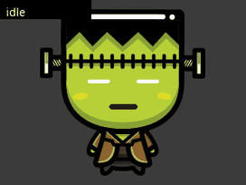

# ESPHome Voice Assistant for the ESP32-S3-BOX-3

A **Home Assistant voice satellite** for the
[ESP32-S3-BOX-3](https://github.com/espressif/esp-box), built on **LVGL and the
touchscreen** instead of the static full-screen images the stock config paints.
Pure ESPHome, no custom C firmware: an always-on core you pull as a package, plus
one thin config file you actually edit.

> **Status: running on an ESP32-S3-BOX-3.** Wake word, the full Assist pipeline,
> voice timers with their alarm, the touchscreen and the animated character are
> all confirmed on device with ESPHome 2026.7.0. Flash usage 25.5%, RAM 37%.
> The newest additions - the wake sound, the third wake word model and the idle
> animation loop - are in the repo but have had less time on hardware than the
> rest. [CHANGELOG.md](CHANGELOG.md) has the detail, including what turned out to
> be wrong along the way.

## What it does

- **Voice assistant**: on-device wake word (`alexa`, `okay nabu`, `hey jarvis`,
  pick one in Home Assistant) via
  `micro_wake_word`, the full Home Assistant Assist pipeline (STT / LLM / TTS),
  and a mic that mutes from HA.
- **LVGL UI**: a page per assistant phase, claimed by whichever screen package
  you install. With none, the core shows plain text status screens; that is the
  floor, not the intended look.
- **Touchscreen**: the GT911 is wired into LVGL. The **button under the screen**
  (which is not a GPIO - it is GT911 touch button 0) starts the assistant, and
  silences a ringing timer instead if one is going. **Tapping the screen while
  idle swaps between the clock and the character**, and back; the choice survives
  a reboot. Starting the assistant is left to the button so that screen taps
  belong to the UI rather than fighting a full-screen tap-to-talk target.
- **Timers**: set by voice, with a countdown and a progress strip on LVGL's top
  layer that stays visible across page changes (green while running, blue while
  paused).
- **TTS routing you choose at runtime**: the reply can come out of the box, out
  of an external Home Assistant media player, or both - see below.
- **Swappable assistant**: the on-screen character is a package - artwork plus
  the measurements of where its face goes - so changing assistants is one line.

## The TTS routing, and why it exists

`voice_assistant:` here has **no `media_player:`**, on purpose.

With one attached, ESPHome does not just hand you the TTS URL - at `TTS_END` it
*also* calls the media player with that URL itself
(`voice_assistant.cpp`: `media_player_->make_call().set_media_url(url)`), so the
box downloads and decodes the audio locally on top of anything you do in
`on_tts_end`. On long replies that local download-and-decode is what made the
device reboot mid-answer while an external speaker played the reply through.

Leaving it out changes nothing about the pipeline - the request flags sent to
Home Assistant don't depend on the media player, so HA still runs TTS and still
delivers the URL to `on_tts_end`. What changes is that **routing is explicit**,
in the `TTS output` select:

| Option | What happens |
|---|---|
| `This device` | The box speaks. Upstream behaviour, local decode included. |
| `External player` | Only `${external_media_player_id}` speaks. The box never fetches the file. |
| `Both` | Both, at the cost of the local decode. |

This routes **spoken replies only**. The timer alarm always rings on the box:
there it repeats until silenced and a tap on the screen stops it, neither of
which a remote speaker can offer, since the box cannot tell when one finishes.
Home Assistant announcements and Music Assistant are unaffected either way -
they go through the `speaker_media_player` component directly.

## Quick start

> Requires **ESPHome 2026.7.0+** - that is where `image:` became a platform component.

1. Copy `secrets.example.yaml` to `secrets.yaml` and fill in your Wi-Fi.
2. Copy **`esp32-s3-box-3-va.yaml`** next to it and edit the `substitutions:` at
   the top (device name, timezone, external media player, artwork). That thin
   file is the only firmware file you keep; the core is pulled from GitHub at
   compile time, see its `packages:` block.
3. **First flash over USB**, then updates go wireless:
   ```
   esphome run esp32-s3-box-3-va.yaml
   ```
   Or drop both files into the ESPHome dashboard's `/config/esphome/` and hit
   Install.
4. In Home Assistant: the new ESPHome device appears, open **Configure** and
   assign an Assist pipeline.
5. Say "Alexa" (or "OK Nabu"), or just tap the screen.

After changing anything in the core, run `esphome clean` before the next build -
otherwise ESPHome reuses the cached copy of the remote package.

## Repository layout

```
esp32-s3-box-3-va.yaml     # YOUR config: copy + edit this (pulls the rest from GitHub)
secrets.example.yaml       # copy to secrets.yaml
base/
  core.yaml                # the always-on core, pulled as a remote package
  screens/
    home.yaml              # optional home screen: clock, date, climate
    face.yaml              # optional animated assistant face (the engine)
  faces/
    pip, astro, momo,      # characters for the face engine
    franky, wizard, genie  #   copy any one of them to add your own
  lang/
    en.yaml, pl.yaml       # UI translations; copy en.yaml to add one
  sounds/
    timer_finished.flac    # the timer alarm, compiled into the firmware
docs/
  HARDWARE.md              # pinout, I2C map, gotchas
scripts/
  validate.py              # offline YAML check (syntax, substitutions, duplicate ids)
  esplog.py                # stream device logs over the native API
skill/
  esp32-s3-box-3/          # Claude Code skill: pinout + hard-won gotchas
```

## Configuration

Day-to-day settings are Home Assistant entities, not config edits: microphone
mute, wake sound, screen brightness, TTS output, wake word engine location, the
wake word itself and the timer switch.

Four substitutions are worth deciding before the first flash:

| Substitution | Default | What it does |
|---|---|---|
| `name` / `friendly_name` | `esp32-s3-box-3-va` / `S3 Box 3 Voice` | Device name. Changing `name` re-creates every entity in Home Assistant. |
| `posix_timezone` | `UTC0` | Clock zone in POSIX form, since the device has no IANA database. Only a fallback until Home Assistant syncs the clock. |
| `external_media_player_id` | `media_player.living_room` | Where the reply goes when `TTS output` is `External player` or `Both`. |
| `tts_output_default` | `This device` | Boot default of that select. |

Everything else has a working default: wake word tuning, sounds, fonts, screen
pages, the boot animation, pins. All of it is in the
[Configuration reference](https://github.com/MichalZaniewicz/esphome-esp32-s3-box-3-va/wiki/Configuration)
on the wiki.

Three wake words are compiled in - **alexa**, **okay nabu** and **hey jarvis** -
and Home Assistant picks between them, one at a time.

## Screens

The core ships one page per assistant phase. Extra screens are optional packages
under `base/screens/` - add the file to your `files:` list to compile it in, drop
the line to leave it out. ESPHome merges each package's `lvgl:` block into one UI.

| Screen | What it adds |
|---|---|
| `home.yaml` | Clock, date, room temperature/humidity and outdoor temperature, in place of the core's plain text idle screen. Needs `idle_page: page_home` and your HA entity ids; day and month names are substitutions, so it localises without touching the core. |
| `face.yaml` | An animated assistant: a static character image with eyes, pupils and a mouth drawn on top as LVGL rectangles, reshaped per phase - blinking and glancing about while idle, wide-eyed listening, pupils darting while thinking, mouth moving while replying, red and shaking when a timer goes off. Claims the active phases and leaves idle alone, so it composes with `home.yaml`. Only the small widgets ever redraw, never the background. |

Install both and the idle screen has two faces: the clock, and the character
idling. **Tap the screen to swap between them** - `idle_page` is what you see
after a reboot, `idle_page_alt` is what a tap switches to, and the last choice is
remembered. Set them to the same page to turn the tap off.

```yaml
  idle_page: page_home      # clock, date, temperatures
  idle_page_alt: page_face  # the character, blinking and looking around
```


### Characters

The face engine and the character are separate: `base/screens/face.yaml` draws
and animates, a file in [`base/faces/`](base/faces/README.md) supplies the
artwork and the measurements. Swapping the assistant is one line:

```yaml
      files:
        - base/core.yaml
        - base/screens/face.yaml
        - base/faces/pip.yaml      # <- after the engine
```

### The cast

Each is one line in `files:`. They are not one face on six bodies - the shape of
the eyes, whether there are pupils at all, the colours and the range of every
expression belong to the character, and the artwork decides all of it.

| | | |
|---|---|---|
|  | **Aura**<br>`base/faces/aura.yaml` | No face, no artwork, nothing to download: nine bars on a line, drawn entirely in code. At rest a still line, a swell while listening, a peak sweeping past while thinking, an equaliser while speaking. Borrowed from a certain film about an operating system. The only one that draws itself, so it is listed **without** `base/screens/face.yaml`. |
|  | **Pip**<br>`base/faces/pip.yaml` | The house robot: earnest, easily impressed, and quietly certain it is the reason the kitchen runs at all. Soft cyan ovals - the reference every other character was measured against. |
|  | **Astro**<br>`base/faces/astro.yaml` | Sealed into a visor and permanently mid-wave, as though it has been waiting all morning for someone to walk in. The visor is wide and shallow, so its eyes are scanner slits. |
|  | **Momo**<br>`base/faces/momo.yaml` | A cat that woke up as a terminal and has decided not to discuss it. Amber pixels on black, square-cornered, deadpan. |
|  | **Franky**<br>`base/faces/franky.yaml` | Assembled from spare parts on somebody's day off. The only one here whose face is skin rather than a screen, so it gets white cartoon eyes and a mouth of its own colour. |
|  | **Wizard**<br>`base/faces/wizard.yaml` | There is nothing under the hat but two burning eyes, and it would rather you did not ask. Almost no mouth, by design. |
|  | **Genie**<br>`base/faces/genie.yaml` | Small, moustachioed and faintly smug: grants timers instead of wishes and considers that an upgrade. The most compact face of the set. |
|  | **Flare**<br>`base/faces/flare.yaml` | A fireball with a face cut into it, jack-o-lantern style. The inverse of everyone else: dark features on a bright body, pupils lit in the flame's own colour so the eyes read as embers. |

Every clip above is idle → thinking → replying, generated by replaying the
animation engine at its real 120 ms tick against that character's own numbers -
so a change to a character shows up in its clip. The only edit is a couple of
seconds trimmed from the idle pause, which on the device is longer and stiller.

Adding one is `cp pip.yaml yours.yaml`, a faceless 320x240 image, and measuring
where its eyes and mouth belong. Every expression dimension is a substitution, so
a bigger or smaller face rescales without touching the engine. Details:
[`base/faces/README.md`](base/faces/README.md).

## Claude Code skill

This repo ships a [Claude Code](https://claude.com/claude-code) skill at
[`skill/esp32-s3-box-3/`](skill/esp32-s3-box-3/SKILL.md): the pinout, the LVGL
and GT911 constraints, and the gotchas that cost real debugging time. Install it
user-wide so any session picks it up:

```bash
cp -r skill/esp32-s3-box-3 ~/.claude/skills/
```

## Credits

- **[esphome/wake-word-voice-assistants](https://github.com/esphome/wake-word-voice-assistants)**:
  the S3-Box-3 config this started as a port of.
- **[espressif/esp-bsp](https://github.com/espressif/esp-bsp)**: the authoritative
  BOX-3 pin map (`bsp/esp-box-3`).
- **ESPHome**: everything the firmware is built out of.
- **[Home Assistant Voice PE](https://github.com/esphome/home-assistant-voice-pe)**:
  the timer sound and the phase model.
