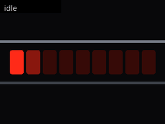
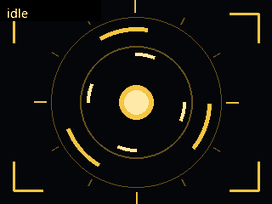
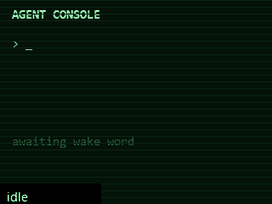
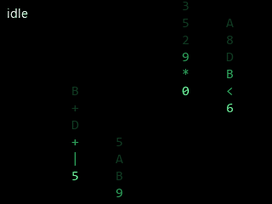
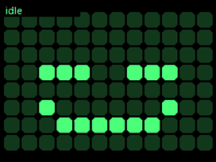
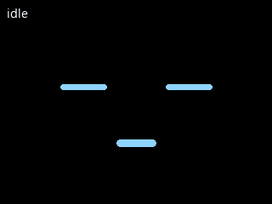
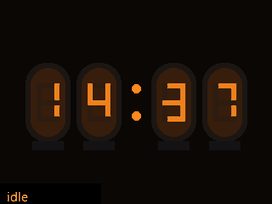
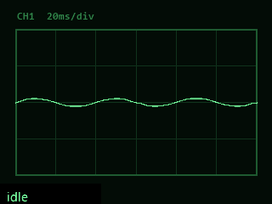
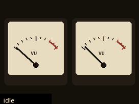
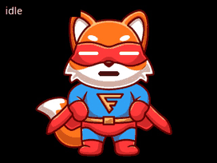

# ESPHome Voice Assistant for the ESP32-S3-BOX-3

A **Home Assistant voice satellite** for the
[ESP32-S3-BOX-3](https://github.com/espressif/esp-box), built on **LVGL and the
touchscreen** instead of the static full-screen images the stock config paints.
Pure ESPHome, no custom C firmware: an always-on core you pull as a package, plus
one thin config file you actually edit.

> **Status: running on an ESP32-S3-BOX-3.** Wake word, the full Assist pipeline,
> voice timers with their alarm, the touchscreen and the animated character are
> all confirmed on device with ESPHome 2026.7.0. Flash usage 25.5%, RAM 37%.
> The newest additions - the wake sound, the third wake word model and the idle
> animation loop - are in the repo but have had less time on hardware than the
> rest. [CHANGELOG.md](CHANGELOG.md) has the detail, including what turned out to
> be wrong along the way.

## What it does

- **Voice assistant**: on-device wake word (`alexa`, `okay nabu`, `hey jarvis`,
  pick one in Home Assistant) via
  `micro_wake_word`, the full Home Assistant Assist pipeline (STT / LLM / TTS),
  and a mic that mutes from HA.
- **LVGL UI**: a page per assistant phase, claimed by whichever screen package
  you install. With none, the core shows plain text status screens; that is the
  floor, not the intended look.
- **Touchscreen**: the GT911 is wired into LVGL. The **button under the screen**
  (which is not a GPIO - it is GT911 touch button 0) starts the assistant, and
  silences a ringing timer instead if one is going. **Tapping the screen while
  idle swaps between the clock and the character**, and back; the choice survives
  a reboot. Starting the assistant is left to the button so that screen taps
  belong to the UI rather than fighting a full-screen tap-to-talk target.
- **Timers**: set by voice, with a countdown and a progress strip on LVGL's top
  layer that stays visible across page changes (green while running, blue while
  paused).
- **TTS routing you choose at runtime**: the reply can come out of the box, out
  of a Home Assistant media player elsewhere in the house, or both. Details:
  [TTS routing](https://github.com/MichalZaniewicz/esphome-esp32-s3-box-3-va/wiki/TTS-routing).
- **Swappable assistant**: the on-screen character is a package - artwork plus
  the measurements of where its face goes - so changing assistants is one line.

## Characters

Swapping the assistant is one word. Each character in
[`base/faces/`](base/faces/README.md) pulls whatever it needs by itself, so
nothing else in the config changes:

```yaml
substitutions:
  assistant: pip     # <- the only line that picks a character

packages:
  core:
    files:
      - base/core.yaml
      - base/faces/${assistant}.yaml
```

Whichever one you name, it exposes the same page id, `page_face`, so
`idle_page_alt: page_face` keeps working across a swap.

### The cast

Twenty of them, and they are not one face on twenty bodies: the eyes, the
colours, the range of every expression and in ten cases the entire way of
being on screen belong to the character. Name any of them in lower case.

<table>
  <tr>
    <td width="290"></td>
    <td><h3>Aura</h3>She has no face and never needed one. A line of light that leans in when you speak, thinks in a single travelling pulse, and breaks into an equaliser when she answers. Warm, unhurried, and entirely comfortable being a voice.</td>
  </tr>
  <tr>
    <td width="290"></td>
    <td><h3>Kitt</h3>A red eye sweeping patiently back and forth, like something that has been on duty a long time and expects to be on duty a while longer. Understated until you ask it for something, then all business.</td>
  </tr>
  <tr>
    <td width="290"></td>
    <td><h3>Jarvis</h3>Immaculately composed: rings turning inside rings, corners squared off, everything measured. Opens up when you address him, tightens while he works the problem, and never once looks flustered.</td>
  </tr>
  <tr>
    <td width="290"></td>
    <td><h3>CRT</h3>An old terminal that never got switched off. Prints back what it heard and types out its answer a character at a time, in green phosphor, as though someone is still at the keyboard on the other end.</td>
  </tr>
  <tr>
    <td width="290"></td>
    <td><h3>Iris</h3>One enormous eye, watching the room over the top of whatever you are cooking. Her pupil opens when you talk to her and shrinks to a pinprick while she thinks it over. Unnerving for about a day, then oddly companionable.</td>
  </tr>
  <tr>
    <td width="290"></td>
    <td><h3>Rain</h3>Weather rather than a face. Drizzles quietly to herself, freezes mid-fall the instant you say her name, and comes down in sheets while she thinks. The only assistant here you would describe as atmospheric.</td>
  </tr>
  <tr>
    <td width="290"></td>
    <td><h3>Pixel</h3>A departure board that got curious about the people reading it. Ninety-six dots that manage a smile, a glance and a blink between them, and are quietly pleased with themselves for it.</td>
  </tr>
  <tr>
    <td width="290"></td>
    <td><h3>Bit</h3>A face and nothing else, floating in the dark. No body, no props, no help: everything Bit has to say is done with two eyes and a small mouth, and it turns out that is plenty.</td>
  </tr>
  <tr>
    <td width="290"></td>
    <td><h3>Rhea</h3>Warm, unhurried and dressed for something considerably more heroic than setting a kitchen timer. Gives the impression she is helping out between assignments and is far too polite to mention it.</td>
  </tr>
  <tr>
    <td width="290"></td>
    <td><h3>Nixie</h3>Four glass tubes with a warm orange filament in each, keeping the time when there is nothing else to do. The only assistant here that earns its place on a shelf while idle. When it answers, the glow travels from tube to tube like something passing through.</td>
  </tr>
  <tr>
    <td width="290"></td>
    <td><h3>Scope</h3>An instrument that has been left switched on and is quietly watching the room. Rests as a flat line, swells into a live waveform when you speak, ties itself into a slow rotating loop while it works, and prints your answer back as a ragged voice trace.</td>
  </tr>
  <tr>
    <td width="290"></td>
    <td><h3>VU</h3>A pair of needles behind glass, the warmest hardware in the set. They rest just off zero with a faint tremble, swing up together when you talk, and jump into the red when the reply gets loud. Nothing else here looks like it belongs to a hi-fi.</td>
  </tr>
  <tr>
    <td width="290"></td>
    <td><h3>Rufus</h3>A fox who has clearly been waiting for someone to need saving and will settle for a kitchen timer. Stands in a hero pose at all times, mask on, entirely sincere about it.</td>
  </tr>
  <tr>
    <td width="290"></td>
    <td><h3>Pip</h3>The house robot: earnest, easily impressed, and quietly certain he is the reason the kitchen runs at all. Soft cyan eyes, boundless goodwill, no discernible ego problem beyond that one.</td>
  </tr>
  <tr>
    <td width="290"></td>
    <td><h3>Astro</h3>Sealed into a visor and permanently mid-wave, as though he has been waiting all morning for somebody to walk in. Cheerful in the specific way of someone with nothing else scheduled.</td>
  </tr>
  <tr>
    <td width="290"></td>
    <td><h3>Momo</h3>A cat that woke up one morning as a terminal and has decided not to discuss it. Amber, square-cornered, deadpan. Answers everything, explains nothing.</td>
  </tr>
  <tr>
    <td width="290"></td>
    <td><h3>Franky</h3>Assembled from spare parts on somebody's day off and delighted about it. The stitches are structural, the enthusiasm is genuine, and he would like you to know he is very good at timers.</td>
  </tr>
  <tr>
    <td width="290"></td>
    <td><h3>Wizard</h3>There is nothing under the hat but two burning eyes, and he would rather you did not ask. Speaks as little as possible and makes each word feel like it cost him something.</td>
  </tr>
  <tr>
    <td width="290"></td>
    <td><h3>Genie</h3>Small, bearded and faintly smug. Grants timers instead of wishes and considers this a promotion. Do not get him started on lamps.</td>
  </tr>
  <tr>
    <td width="290"></td>
    <td><h3>Flare</h3>A fireball with a face cut into it, lit from the inside like a lantern. Burns bright, burns constantly, and has never in its life been described as restful.</td>
  </tr>
</table>

Every clip above runs idle → thinking → replying, with listening added where a
character does something distinct with it, generated by replaying the
animation at its real tick against that character's own numbers, read out of its
YAML - so a change to a character shows up in its clip. The only edit is a couple
of seconds trimmed from the idle pause, which on the device is longer and stiller.

The first seven need no artwork at all and draw themselves. For the rest, adding
one is `cp pip.yaml yours.yaml`, a faceless 320x240 image, and measuring where its
eyes and mouth belong. Every expression dimension is a substitution, so a bigger
or smaller face rescales without touching the engine. Details:
[`base/faces/README.md`](base/faces/README.md).

## Quick start

> Requires **ESPHome 2026.7.0+** - that is where `image:` became a platform component.

1. Copy `secrets.example.yaml` to `secrets.yaml` and fill in your Wi-Fi.
2. Copy **`esp32-s3-box-3-va.yaml`** next to it and edit the `substitutions:` at
   the top (device name, external media player, room sensors). That thin
   file is the only firmware file you keep; the core is pulled from GitHub at
   compile time, see its `packages:` block.
3. **First flash over USB**, then updates go wireless:
   ```
   esphome run esp32-s3-box-3-va.yaml
   ```
   Or drop both files into the ESPHome dashboard's `/config/esphome/` and hit
   Install.
4. In Home Assistant: the new ESPHome device appears, open **Configure** and
   assign an Assist pipeline.
5. Say "Alexa" (or "OK Nabu", or "Hey Jarvis"), or press the button under the
   screen.

After changing anything in the core, run `esphome clean` before the next build -
otherwise ESPHome reuses the cached copy of the remote package.

## Repository layout

```
esp32-s3-box-3-va.yaml     # YOUR config: copy + edit this (pulls the rest from GitHub)
secrets.example.yaml       # copy to secrets.yaml
base/
  core.yaml                # the always-on core, pulled as a remote package
  screens/
    home.yaml              # optional home screen: clock, date, climate
    face.yaml              # optional animated assistant face (the engine)
  faces/
    pip, astro, momo,      # characters; pick one with `assistant:`
    franky, wizard,        #   each pulls the face engine itself
    genie, flare, aura     #   aura draws itself, no artwork
  lang/
    en.yaml, pl.yaml       # UI translations; copy en.yaml to add one
  sounds/
    timer_finished.flac    # the timer alarm, compiled into the firmware
docs/
  HARDWARE.md              # pinout, I2C map, gotchas
scripts/
  validate.py              # offline YAML check (syntax, substitutions, duplicate ids)
  esplog.py                # stream device logs over the native API
skill/
  esp32-s3-box-3/          # Claude Code skill: pinout + hard-won gotchas
```

## Configuration

Day-to-day settings are Home Assistant entities, not config edits: microphone
mute, wake sound, screen brightness, TTS output, wake word engine location, the
wake word itself and the timer switch.

Three substitutions are worth deciding before the first flash. The clock is not
among them: Home Assistant supplies the time zone along with the time.

| Substitution | Default | What it does |
|---|---|---|
| `name` / `friendly_name` | `esp32-s3-box-3-va` / `S3 Box 3 Voice` | Device name. Changing `name` re-creates every entity in Home Assistant. |
| `external_media_player_id` | `media_player.living_room` | Where the reply goes when `TTS output` is `External player` or `Both`. |
| `tts_output_default` | `This device` | Boot default of that select. |

Everything else has a working default: wake word tuning, sounds, fonts, screen
pages, the boot animation, pins. All of it is in the
[Configuration reference](https://github.com/MichalZaniewicz/esphome-esp32-s3-box-3-va/wiki/Configuration)
on the wiki.

Three wake words are compiled in - **alexa**, **okay nabu** and **hey jarvis** -
and Home Assistant picks between them, one at a time.

## Screens

The core ships one page per assistant phase. Extra screens are optional packages
under `base/screens/` - add the file to your `files:` list to compile it in, drop
the line to leave it out. ESPHome merges each package's `lvgl:` block into one UI.

| Screen | What it adds |
|---|---|
| `home.yaml` | Clock, date, room temperature/humidity and outdoor temperature, in place of the core's plain text idle screen. Needs `idle_page: page_home` and your HA entity ids; day and month names are substitutions, so it localises without touching the core. |
| `face.yaml` | An animated assistant: a static character image with eyes, pupils and a mouth drawn on top as LVGL rectangles, reshaped per phase - blinking and glancing about while idle, wide-eyed listening, pupils darting while thinking, mouth moving while replying, red and shaking when a timer goes off. Claims the active phases and leaves idle alone, so it composes with `home.yaml`. Only the small widgets ever redraw, never the background. |

Install both and the idle screen has two faces: the clock, and the character
idling. **Tap the screen to swap between them** - `idle_page` is what you see
after a reboot, `idle_page_alt` is what a tap switches to, and the last choice is
remembered. Set them to the same page to turn the tap off.

```yaml
  idle_page: page_home      # clock, date, temperatures
  idle_page_alt: page_face  # the character, blinking and looking around
```

## Claude Code skill

This repo ships a [Claude Code](https://claude.com/claude-code) skill at
[`skill/esp32-s3-box-3/`](skill/esp32-s3-box-3/SKILL.md): the pinout, the LVGL
and GT911 constraints, and the gotchas that cost real debugging time. Install it
user-wide so any session picks it up:

```bash
cp -r skill/esp32-s3-box-3 ~/.claude/skills/
```

## Credits

- **[esphome/wake-word-voice-assistants](https://github.com/esphome/wake-word-voice-assistants)**:
  the S3-Box-3 config this started as a port of.
- **[espressif/esp-bsp](https://github.com/espressif/esp-bsp)**: the authoritative
  BOX-3 pin map (`bsp/esp-box-3`).
- **ESPHome**: everything the firmware is built out of.
- **[Home Assistant Voice PE](https://github.com/esphome/home-assistant-voice-pe)**:
  the timer sound and the phase model.
