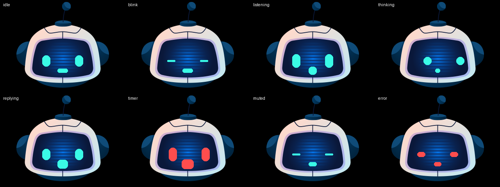

# Characters

The assistant on screen is split in two: `base/screens/face.yaml` is the
**engine** - it draws two eyes and a mouth and animates them per phase - and a
file in here is a **character**: one image plus the numbers that say where its
features go. Swapping the assistant is one line in `files:`.


Animated, one clip each: [pip](../assets/demo/demo-pip.gif) · [astro](../assets/demo/demo-astro.gif) · [momo](../assets/demo/demo-momo.gif) · [franky](../assets/demo/demo-franky.gif) · [wizard](../assets/demo/demo-wizard.gif) · [genie](../assets/demo/demo-genie.gif)

| Character | Look | Face style |
|---|---|---|
| **Pip** | Round head, antenna, blue panel | Soft cyan ovals. The reference - every other character was measured against it. |
| **Astro** | Astronaut, sealed visor | Cyan capsule slits. The visor is wide and shallow, profiled row by row; tall eyes do not fit. |
| **Momo** | Cat ears, black screen | Amber square pixels, barely rounded. The artwork has no colour of its own. |
| **Franky** | Green monster, bolts, stitches | White cartoon eyes with black pupils - the only face here that is skin rather than a display, so it gets a separate mouth colour. |
| **Wizard** | Void under a purple hat | Glowing gold eyes and almost no mouth. The void sits below the hat brim, not at the frame's centre. |
| **Genie** | Small head, big moustache | The most compact face of the set; the mouth is a hint under the moustache. |

`face_center_x` shifts the whole face sideways when the artwork is not centred.
Most of these do not need it - five of the six sit on the frame's axis and only
Wizard is off by 3 px. Measure before reaching for it: reading coordinates off a
scaled screenshot is exactly how a first pass got Franky and Genie wrong by 20 px
each. Compare the left and right halves of the image and find the axis where they
mirror; if that lands on 160, the offset is zero.

Every expression the engine draws, for reference:



## Using one

```yaml
packages:
  core:
    url: https://github.com/MichalZaniewicz/esphome-esp32-s3-box-3-va
    files:
      - base/core.yaml
      - base/screens/face.yaml
      - base/faces/pip.yaml        # <- after the engine
```

Order matters: ESPHome resolves later-listed package files at a higher priority,
so a character listed *before* the engine is silently ignored - you get the
engine's defaults and no error.

## Adding one

1. **Draw the character with no face.** 320x240 PNG. The eyes and mouth are
   drawn on top at runtime, so leave the space where they belong empty. If you
   are adapting existing artwork that already has a face, erase it - the blank
   area needs to match whatever is behind it, or the drawn features will sit on
   a patch.
2. `cp pip.yaml mycharacter.yaml`, point `face_background_file` at your image,
   and adjust the geometry.
3. Measure rather than guess. Open your original artwork, note the pixel
   coordinates of the eyes and mouth, and convert them to offsets from the
   centre of a 320x240 frame (so centre is `160,120`; `face_eye_y: 36` means 36
   pixels *below* centre). That is how `pip.yaml` was built, and it landed
   right first time.
4. Pull requests welcome.

## What a character controls

| Group | Substitutions |
|---|---|
| Artwork | `face_background_file` |
| Colour | `face_color`, `face_alarm_color` |
| Resting shape | `face_eye_offset`, `face_eye_y`, `face_eye_w`, `face_eye_h`, `face_mouth_y`, `face_mouth_w`, `face_mouth_h` |
| Expressions | `face_eye_h_wide`, `face_eye_h_narrow`, `face_eye_h_shut`, `face_mouth_open_h`, `face_mouth_small_w`, `face_mouth_o_w`, `face_mouth_o_h`, `face_mouth_alarm_w`, `face_mouth_alarm_h`, `face_mouth_error_w` |
| Motion | `face_gaze_dx`, `face_shake_dx`, `face_idle_cycle`, `face_tick` |
| Corners | `face_eye_radius`, `face_mouth_radius` |

Every expression dimension is a substitution precisely so a character with a
larger or smaller face can rescale its whole range without editing the engine.
An eye is a rounded rectangle: give it a radius of half its height and it reads
as an oval, keep the radius small and it reads as a screen pixel block.

## Limits worth knowing before you design one

- **Two eyes and one mouth, all rectangles.** No eyebrows, no pupils, no curves.
  Expression comes from proportion and motion, which is enough - see the preview
  above - but a character that needs a frown will need the engine extended.
- **The background never redraws.** That is what keeps the animation cheap on
  this hardware, and it means the artwork cannot animate. Anything that should
  move has to be one of the three widgets.
- **Only the mouth speaks.** During a reply it opens and closes on a fixed
  cycle; it is not driven by the audio, which the box never sees when TTS is
  routed to an external player.
