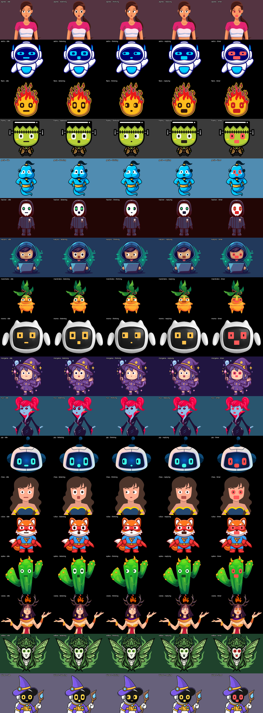
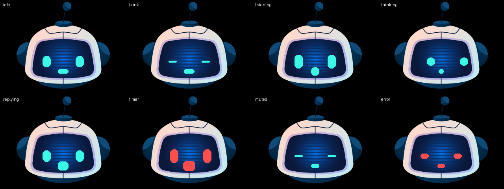

# Characters

The assistant on screen is split in two: `base/screens/face.yaml` is the
**engine** - it draws two eyes and a mouth and animates them per phase - and a
file in here is a **character**: one image plus the numbers that say where its
features go. Swapping the assistant is one word: `assistant:`.

Whichever character is installed, it exposes the same page id, `page_face`, so a
config can point a phase at it without knowing which one is in use.



Animated, one clip each: [aura](../assets/demo/demo-aura.gif) · [bit](../assets/demo/demo-bit.gif) · [pixel](../assets/demo/demo-pixel.gif) · [iris](../assets/demo/demo-iris.gif) · [rain](../assets/demo/demo-rain.gif) · [crt](../assets/demo/demo-crt.gif) · [pip](../assets/demo/demo-pip.gif) · [astro](../assets/demo/demo-astro.gif) · [momo](../assets/demo/demo-momo.gif) · [franky](../assets/demo/demo-franky.gif) · [wizard](../assets/demo/demo-wizard.gif) · [genie](../assets/demo/demo-genie.gif) · [flare](../assets/demo/demo-flare.gif) · [kitt](../assets/demo/demo-kitt.gif) · [nixie](../assets/demo/demo-nixie.gif) · [scope](../assets/demo/demo-scope.gif) · [vu](../assets/demo/demo-vu.gif) · [rhea](../assets/demo/demo-rhea.gif) · [rufus](../assets/demo/demo-rufus.gif) · [agnes](../assets/demo/demo-agnes.gif) · [kacpro](../assets/demo/demo-kacpro.gif) · [hacker](../assets/demo/demo-hacker.gif) · [mandrake](../assets/demo/demo-mandrake.gif) · [spike](../assets/demo/demo-spike.gif) · [willow](../assets/demo/demo-willow.gif) · [nyx](../assets/demo/demo-nyx.gif) · [vesta](../assets/demo/demo-vesta.gif) · [morgana](../assets/demo/demo-morgana.gif)

The preview image above shows only the characters that use artwork; `aura`, `bit`, `pixel`,
`iris`, `rain`, `crt`, `kitt`, `nixie`, `scope` and `vu` draw themselves and are in the clips.

Every clip is generated by [`scripts/gen_demos.py`](../../scripts/gen_demos.py),
which replays each character's own animation off-device: the artwork ones
through the face engine, the self-drawing ones through a port of their tick
in [`scripts/gen_demos_drawn.py`](../../scripts/gen_demos_drawn.py). Both read
the numbers out of the character's YAML, so a change to a character shows up
in its clip without a build.

| Character | Look | Face style |
|---|---|---|
| **Pip** | Round head, antenna, blue panel | Soft cyan ovals. The reference - every other character was measured against it. |
| **Astro** | Astronaut, sealed visor | Cyan capsule slits. The visor is wide and shallow, profiled row by row; tall eyes do not fit. |
| **Momo** | Cat ears, black screen | Amber square pixels, barely rounded. The artwork has no colour of its own. |
| **Franky** | Green monster, bolts, stitches | White cartoon eyes with black pupils - the only face here that is skin rather than a display, so it gets a separate mouth colour. |
| **Wizard** | Void under a purple hat | Glowing gold eyes and almost no mouth. The void sits below the hat brim, not at the frame's centre. |
| **Genie** | Small head, big beard | The most compact face of the set; both features sit above the beard, which begins just below the mouth. |
| **Rhea** | Wavy brown hair, gold and blue | White cartoon eyes with brown pupils. The artwork arrived with closed-eye arcs already drawn near the fringe; they were kept as eyebrows and the real eyes placed in the clean area below, rather than repainting hair to erase them. |
| **Kitt** | No artwork at all | Two rails and nine segments, drawing itself. Nothing moves and nothing resizes: the sweep is brightness alone, nine colour writes per tick, which makes it the cheapest animation in the repo. |
| **Nixie** | No artwork at all | Four tubes and 28 segments, drawing itself. Reads `ha_time`, so it shows the clock while idle. Colours are written through the LVGL C API for changed objects only. |
| **Scope** | No artwork at all | The only character drawing a continuous curve. `lvgl.line.update` takes points fixed at build time, so the lambda calls `lv_line_set_points()` instead; the point array must be `static`, since LVGL keeps the pointer rather than copying. |
| **VU** | No artwork at all | Two needles, each a two-point line written the same way as Scope's trace, because LVGL cannot rotate a rectangle. Faces, scale and red zone are built once and never touched: a tick costs two writes. |
| **Rufus** | Masked fox in a hero pose | White eyes with dark pupils, sitting ON the red mask, which is flat colour so nothing had to be erased. Watch out for the two white slits above the mask: they read as narrow eyes and are brow shading. Taking them for eyes puts the face 20 px too high. |
| **Agnes** | Ponytail, warm skin | White eyes with dark pupils, placed UNDER the lash line. Her dark curves are brows and lashes, not eyes: the artwork came with the eyes and mouth already removed, so the lashes are her upper lid and erasing them costs her the lid. Nose stays. |
| **Aura** | No artwork at all | Nine bars on a line: flat at rest, an equaliser while speaking. No eyes and no mouth, so it skips the engine entirely and draws itself. |
| **Bit** | No artwork at all | Two eyes with pupils and a small mouth on black. Draws itself. Started out as eyes only; the mouth was added because eyes alone cannot show speech, which left `replying` and `listening` looking identical. |
| **Iris** | No artwork at all | One eye filling the screen. Draws itself. Everything it does is a size change on the iris and pupil plus a height change on two eyelid rectangles, which is why it is the cheapest full-screen character here. |
| **Rain** | No artwork at all | Falling glyphs, drawing itself. Nothing moves: each column is a still label whose text is rewritten every tick. The brightness gradient down a trail needs LVGL's `recolor` markup, since one label otherwise carries one colour. |
| **CRT** | No artwork at all | A green terminal, drawing itself. Reads `text_request` and `text_response` from the core, so it prints what was said and types out the reply. The only character with words in it, and so the only one `base/lang/*.yaml` has to translate. |
| **Pixel** | No artwork at all | A 12x8 LED matrix, drawing itself. Dots carry brightness rather than just on and off, and a pupil is an unlit dot inside a lit 3x3 eye, because at that density a separate pupil would not fit. |
| **Flare** | Burning blob, flames on top | Dark features cut into a bright body, with the pupil lit in the body's own yellow. The only inverted face here, and a useful demonstration that `face_color` need not be the bright one. |
| **KacPRO** | Hood, laptop, green glow | White cartoon eyes with dark pupils on skin. The hood leaves 34 px of usable height between the fringe and the chin, so the eyes are wider than they are tall and the mouth opens by 14 rather than 22. |
| **hacker** | Empty hood, skull badge | The only DARK-eyed character with BRIGHT pupils: black shapes on the blank white face with a green dot inside, which reads as a glow. The face sits 50 px above the frame's centre, so every offset here is a large negative number. |
| **Mandrake** | Root in a pot, leaves on top | White eyes with green pupils. The artwork arrived asleep - closed-eye arcs and lips painted on the bulb - and those were erased, unlike rhea's, because a drawn eye on top of a painted closed one reads as a bruise. The two dark leaves above were kept and work as eyebrows. The tightest face in the set: 21 px between the leaves and the collar. |
| **Vesta** | Horns, a flame, a very level stare | White eyes with dark plum pupils. The artwork kept the brows, the nose AND the eye shadow - two soft blocks under the brows - and that shadow is the best landmark on the face, because it is exactly where the eyes were. Her face sits right of frame centre, so the axis is 167 rather than 160. |
| **Willow** | Emblem: wings, leaf crown, pale mask | Green eyes with a near-black pupil, on a mask carrying nothing but a nose. The artwork is symmetric, so the mirror axis really is x 160 and the nose is a third landmark that checks the scale rather than something to compromise with. The eyes are deliberately LARGER than the original's proportions give - at this size the measured numbers read as beady. |
| **Nyx** | Red pigtails, blue skin, black cape | Dark violet eyes with red pupils. The artwork keeps the angry slanted eyebrows and the nose, and those do the acting for free. Her head is turned, so the eyes want an axis at 148 and the mouth one at 144; the engine's single axis splits it at 147. |
| **Morgana** | Witch in a purple hat, wand with a ghost on it | White eyes with a deep violet pupil, on a chibi face that is mostly cheek. The artwork came with no eyes and no mouth, and the two dark marks above are BROWS - read as closed eyes they put the whole face on the forehead. They set the spacing; the blush marks set the mouth, since nothing else below the eyes is drawn. |
| **Spike** | Cactus: a head on a stem, an arm each side, orange spines on top | White eyes with a dark green pupil and mouth. The roomiest artwork face here, so it carries the largest eyes of any character with a picture. The stem leans: its mirror axis is x 157, not 160. |

`face_center_x` shifts the whole face sideways when the artwork is not centred.
Most of these do not need it - five of the six sit on the frame's axis and only
Wizard is off by 3 px. Measure before reaching for it: reading coordinates off a
scaled screenshot is exactly how a first pass got Franky and Genie wrong by 20 px
each. Compare the left and right halves of the image and find the axis where they
mirror; if that lands on 160, the offset is zero.

Every expression the engine draws, for reference:



## Using one

```yaml
substitutions:
  assistant: pip

packages:
  core:
    url: https://github.com/MichalZaniewicz/esphome-esp32-s3-box-3-va
    files:
      - base/core.yaml
      - base/faces/${assistant}.yaml
    refresh: 0s
```

Naming the file is enough because a character declares its own `packages:` block
pulling `base/screens/face.yaml`. ESPHome collects a package's substitutions
before descending into its nested packages, and earlier-collected values win, so
the character's geometry beats the engine's defaults rather than the other way
round.

`aura`, `bit`, `pixel`, `iris`, `rain`, `crt`, `kitt`, `nixie`, `scope` and `vu` are the exceptions: they have no
artwork and no engine, and draw themselves. Naming one is still all you do, which
is the point of a character pulling its own dependencies rather than the config
having to know which of them needs what.

Order still matters between siblings: the language package goes last, since
later-listed files win substitution conflicts.

## Switching one while it runs

`picker.yaml` adds an **Assistant** select to Home Assistant. Pick a name and the
artwork, the geometry and the colours change on the spot - no rebuild - and the
choice survives a reboot.

```yaml
substitutions:
  assistant: pip          # compiled in, and the first option
  pick_2: rufus           # three more, compiled in alongside it
  pick_3: mandrake
  pick_4: hacker

packages:
  core:
    files:
      - base/core.yaml
      - base/faces/${assistant}.yaml
      - base/faces/picker.yaml
```

**Four, and not all of them, because the artwork is the cost.** A character's PNG
is 320x240 RGB565 = 150 KB of flash whether or not it is ever shown; four is
450 KB on top of the one you already had. Which four is a compile-time decision.
Switching between them is not. The four names have to differ - a select cannot
carry the same option twice.

Only characters with artwork can be picked. The self-drawing ones are whole pages
of their own rather than numbers on top of a picture, so there is nothing to swap.

`picker.yaml` is **generated** by [`scripts/gen/gen_picker.py`](../../scripts/gen/gen_picker.py)
from the character files in this directory, which stay the source of truth: it
carries a table of every artwork character's numbers, and a table copied by hand
would drift from the character the first time somebody nudged an eye.

What made this possible is that the engine's geometry moved from compile-time
substitutions into runtime globals (`fg_*` in `base/screens/face.yaml`). A
character package still just sets substitutions; they are now the *initial
values* of those globals rather than constants pasted into every lambda. A config
that names one assistant and never installs the picker behaves exactly as before.

## Adding one

1. **Draw the character with no face.** 320x240 PNG. The eyes and mouth are
   drawn on top at runtime, so leave the space where they belong empty. If you
   are adapting existing artwork that already has a face, erase it - the blank
   area needs to match whatever is behind it, or the drawn features will sit on
   a patch. `mandrake` is the worked example: closed eyes and lips painted on a
   gradient, grown back over from the surrounding pixels rather than filled
   with one flat colour, which would have shown.
2. `cp pip.yaml mycharacter.yaml`, point `face_background_file` at your image,
   and adjust the geometry.
3. Measure rather than guess. Open your original artwork, note the pixel
   coordinates of the eyes and mouth, and convert them to offsets from the
   centre of a 320x240 frame (so centre is `160,120`; `face_eye_y: 36` means 36
   pixels *below* centre). That is how `pip.yaml` was built, and it landed
   right first time.
4. Pull requests welcome.

## Seven of these files are generated - do not edit them

`crt`, `kitt`, `nixie`, `pixel`, `rain`, `scope` and `vu` are written
by the scripts in [`scripts/gen/`](../../scripts/gen). They have to be, because
each one is mostly a few hundred near-identical widget definitions: 96 lamps for
`pixel`, 38 for `nixie`, 30 scanlines for `crt`. Editing them by hand is fine
right up until somebody runs the generator, and then the edit is gone with no
warning and no diff to explain it.

That is not hypothetical. `kitt.yaml` was optimised directly, its generator was
not, and the two sat out of step until it was noticed by accident.

So: **change the generator, then run it.** To check the whole set is consistent:

```
python scripts/check_generated.py
```

It regenerates everything, compares against what is committed, restores anything
it touched, and fails if a file and its generator disagree. Run it before
opening a pull request that touches any of the eight.

## What a character controls

| Group | Substitutions |
|---|---|
| Artwork | `face_background_file` |
| Colour | `face_color`, `face_alarm_color` |
| Resting shape | `face_eye_offset`, `face_eye_y`, `face_eye_w`, `face_eye_h`, `face_mouth_y`, `face_mouth_w`, `face_mouth_h` |
| Expressions | `face_eye_h_wide`, `face_eye_h_narrow`, `face_eye_h_shut`, `face_mouth_open_h`, `face_mouth_small_w`, `face_mouth_o_w`, `face_mouth_o_h`, `face_mouth_alarm_w`, `face_mouth_alarm_h`, `face_mouth_error_w` |
| Motion | `face_gaze_dx`, `face_shake_dx`, `face_idle_cycle`, `face_tick` |
| Corners | `face_eye_radius`, `face_mouth_radius` |

Every expression dimension is a substitution precisely so a character with a
larger or smaller face can rescale its whole range without editing the engine.
An eye is a rounded rectangle: give it a radius of half its height and it reads
as an oval, keep the radius small and it reads as a screen pixel block.

## Limits worth knowing before you design one

- **Two eyes and one mouth, all rectangles.** No eyebrows, no pupils, no curves.
  Expression comes from proportion and motion, which is enough - see the preview
  above - but a character that needs a frown will need the engine extended.
- **The background never redraws.** That is what keeps the animation cheap on
  this hardware, and it means the artwork cannot animate. Anything that should
  move has to be one of the three widgets.
- **Only the mouth speaks.** During a reply it opens and closes on a fixed
  cycle; it is not driven by the audio, which the box never sees when TTS is
  routed to an external player.
